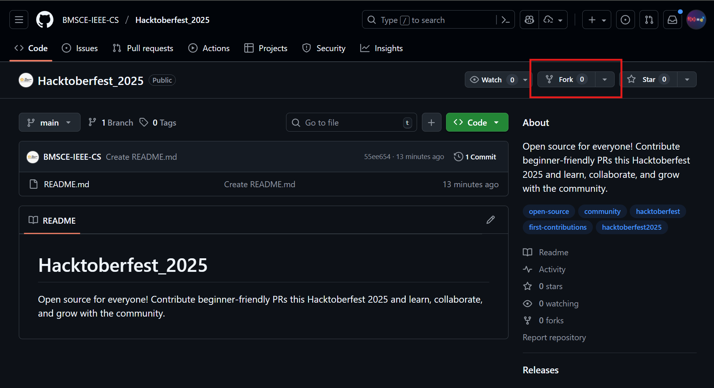

# Hacktoberfest 2025 - Wings

The idea of this exercise is to make it clear to you the concept of GitHub contributions via a simple task of contributing to the repository marked below. This repository is also helpful if you are participating in this year’s [Hacktoberfest](https://hacktoberfest.com/), so do register there before contributing here.

## Task in Brief

Submit your contribution to the [Hacktoberfest 2025 Repository](https://github.com/BMSCE-IEEE-CS/Hacktoberfest_2025)!

You can add:

- 🌐 Web development projects
- 🧮 DSA or algorithmic solutions

Create a **pull request (PR)** with your work and wait for it to be reviewed.

Once it’s accepted, you’ve made a valid Hacktoberfest contribution! 🚀

> Any queries, please feel free to use the group

## Get Started

- Create an account on [GitHub](https://github.com) and log in to the [Hacktoberfest](https://hacktoberfest.com/) website to get started
- Download and set up [Git](https://git-scm.com/downloads) and [VS Code](https://code.visualstudio.com/) on your local machine
- Fork the repository from [here](https://github.com/BMSCE-IEEE-CS/Hacktoberfest_2025)




- Ensure that you are on your forked repository. Click on **Clone**, \*\*\*\*and copy the link under the HTTPS clone method


- Clone the repository on your local machine and open it using VS Code using the following commands

```bash
git clone https://github.com/<username>/Hacktoberfest_2025.git
cd Hacktoberfest_2025
code .
```

- Once VS Code is open, create a folder with your name, and add the desired code of your choice(Web Development or DSA)


- Push the code to your remote origin using the following commands

```bash
git add .
git commit -m "added my codes"
git push origin main
```

- Contribute by creating a Pull Request from your remote origin


- Address any merge conflicts in the next step, if any. It will be presented to you if there are any merging issues. Go back to VS Code, make the changes, push the code, and repeat this until no merge conflict is seen. Once done, give this pull request a title in the format of `<name> - <message/project idea>` and click on **Create pull request** button


- ANDDDD… YOU ARE DONE 🎉🎉🎉


## Next Steps

- Wait until we merge your PRs :)
- Explore Hacktoberfest repositories by visiting [here](https://github.com/topics/hacktoberfest2025), and start contributing to them
- Help your peers if they are stuck in any of the above-mentioned steps, or teach a simpler approach to address the same
